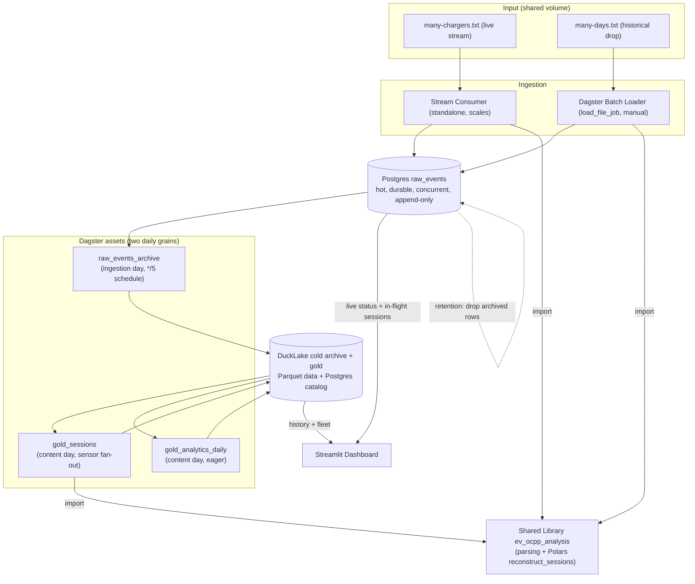

# OCPP Ingestion Architecture

## Overview

EV Coorp's chargers emit OCPP 1.6 two ways: a continuous live stream and en-bloc historical file drops when a charger or site is onboarded. Both flow through **one shared parsing library**, land raw frames in a durable, concurrent Postgres hot landing zone, archive to an immutable cold store, and derive charging-session facts (gold) for cheap analytical reads.

Two axes split the system. **Ingestion mode:** a standalone always-on service handles the live stream; a Dagster batch loader (`load_file_job`) handles historical drops — both write the same `raw_events` table. **Data temperature:** frames land hot in Postgres, then Dagster assets archive new rows to the cold store, rebuild gold session facts, and roll up daily analytics on two daily grains (archive by *ingestion day*, gold by *content day*; see Partitioning). All business logic is **Polars** — not SQL, not an ORM; one shared ordered fold reconstructs sessions for both historical gold and live in-flight views. The whole topology runs under docker-compose.

Cold archive and gold are **DuckLake** tables: Parquet data plus a SQL catalog kept in the shared **Postgres** (`ducklake_catalog`) so every client attaches concurrently. See Storage Rationale.

## How this addresses the client's needs

The brief's pain points and how the design answers each:

- **Fragmented sources → one shape.** A live stream and historical file drops are parsed by one shared library into one append-only Postgres table, so everything downstream sees a single `RawRow` contract.
- **Real-time *and* historical.** The dashboard reads Postgres for live status and in-flight sessions, and the DuckLake gold tables for completed-session history and fleet rollups — the same sessionization fold powers both.
- **Aggregation across dimensions.** Analytics roll up per charger, per connector, and per day, with a nullable `site_id` ready for multi-site; the dashboard also computes ad-hoc rollups on the fly in Polars.
- **Growing data volumes.** Hot data in Postgres (short retention) is tiered to an immutable DuckLake lakehouse; two daily partition grains bound how much each run reprocesses.
- **Error-prone manual analysis.** Session status is explicit (`completed` / `active` / `incomplete`), the derived layer is duplicate-tolerant, and unparseable frames are counted rather than crashing — so the operational picture is trustworthy without hand-curation.
- **Portable, not throwaway.** The whole topology is docker-compose for local dev; [`technical-debt.md`](technical-debt.md) lists the swaps (object-store data, managed Postgres, a Dagster metadata DB) to take it to production.

## Architecture

Both ingestion paths import `ev_ocpp_analysis` and write the same `RawRow` shape to Postgres — the single convergence point. Three assets then run on two daily grains: `archive_schedule` materializes the current ingestion-day `raw_events_archive` partition every 5 minutes; an asset sensor fans `session_job` out to each content day the newly-archived data touched; and `gold_analytics_daily` re-materializes those content days eagerly (`AutomationCondition`). See Partitioning. The dashboard reads gold for completed-session history and fleet rollups, and reads Postgres directly for live status and in-flight session reconstruction (same shared fold over a bounded recent window).

The landing table is **append-only**: both producers write plain parameterized `INSERT`s. No unique constraint, no dedup pass — duplicate business frames (stream replay or a re-dropped file) are recorded intentionally, and the derived layer collapses them at read time.

## Partitioning

Two independent daily grains keep each run bounded instead of reprocessing everything:

- **Ingestion day** (`raw_events_archive`) — real wall-clock `ingest_ts`, open-ended. `archive_schedule` materializes today's partition every 5 min, replacing that day's slice idempotently.
- **Content day** (`gold_sessions`, `gold_analytics_daily`) — session `start_time`, a static range over the sample data. An asset sensor maps each archived ingestion day to the content days it touched and requests those session partitions; analytics follow eagerly.

The grain efficient to ingest (ingestion day) differs from the grain correct for sessions (content day), and a session can straddle both — so the mapping is a fan-out, not a 1:1. `gold_sessions` reads the full archive per run — acceptable for the demonstrator; see [`technical-debt.md`](technical-debt.md).

## Components

### Shared Parsing Library

**Package:** `ev_ocpp_analysis` (`packages/analysis`). A plain library callers **import**; it holds no I/O of its own. The core logic:

1. **Parsing** — `parse_raw_row` turns a raw OCPP-J line into a structured `RawRow` (MessageTypeId 2/3/4, UniqueId, Action, payload). It splits the frame **structurally** and carries the payload through intact; no interpretation or pivoting.
2. **Sessionization (Polars)** — `reconstruct_sessions`, a source-agnostic ordered fold: open on `StartTransaction`, accumulate `Power.Active.Import` samples (extracted here from each event's payload) while open, close on `StopTransaction`. A fold is required (not a `GROUP BY`) because the session key only exists after the opening event. Status is one of `completed` / `active` / `incomplete`.

**Duplicate tolerance:** because the raw layer is append-only, the fold is idempotent to duplicate raw events — content-identical frames are collapsed inside the fold, so sessions, counts, and energy are not double-counted.

The package also holds measurand extraction, daily analytics, the charger→site dimension, the Postgres/DuckLake persistence helpers, and the readers.

### Per-Source Readers (thin)

Each source provides a thin reader returning a Polars frame for the identical fold, so "fetch → fold" is one import: `read_archive_ducklake` (DuckDB reads the cold table with pushdown) and `read_recent_window_postgres` (bounded recent window via ConnectorX).

### Stream Consumer Service

**Package:** `ev_ocpp_stream`, its own container. A permanent consumer: reads `many-chargers.txt` line-by-line, parses each frame, writes each as a committed parameterized `INSERT` (per-message durable) via **psycopg**. Independent of Dagster, scales horizontally against the one append-only table.

### Dagster Historical / Batch Loader

**Package:** `ev_ocpp_dagster`. `load_file_job` parses a dropped file and bulk-`INSERT`s raw events into `raw_events`, reporting an `AssetMaterialization` for the `raw_events` source asset. A directory-scan sensor exists but for the demonstrator the job is **launched manually** (Launchpad, op config = the file path).

### Dagster Asset Pipeline (archive → sessions → analytics)

`raw_events` is an external **source asset** (the Postgres landing zone, written by the stream and loader); three computed assets sit downstream on two daily grains (see Partitioning):

- **`raw_events_archive`** (ingestion day) — copies the partition's `raw_events` slice into the immutable cold DuckLake archive via delete-day-then-insert; `archive_schedule` runs it every 5 min. Each write is a snapshot.
- **`gold_sessions`** (content day) — reads the archive and rebuilds session facts via `reconstruct_sessions` (keyed by `charger_id + connector_id + start_time`) plus per-session readings. An asset sensor fans runs out per content day a new archive partition touched.
- **`gold_analytics_daily`** (content day, eager) — rolls sessions up into one row per `(charger_id, connector_id, day)`, with fault counts from archived `StatusNotification`s.

### Streamlit Dashboard

**Package:** `ev_ocpp_dashboard` (`packages/dashboard`).

- **Live status view:** poll Postgres for a cheap latest-event-per-charger snapshot (status, latest power/SoC). No sessionization.
- **In-flight session view:** run the shared fold over a bounded recent Postgres window to show open sessions with running duration and energy.
- **History + fleet analytics:** read gold DuckLake tables and compute per-charger / per-day rollups on the fly in Polars.
- Filter across time and charger (future: site).

### Package → Component Map

The Dagster host (`packages/dagster-server`) runs the webserver + daemon serving the `ev_ocpp_dagster` code location (loader, schedule, sensors, assets).

| Component | Package | Container |
|-----------|---------|-----------|
| Parsing + Polars sessionization + readers | `ev_ocpp_analysis` | library |
| Stream consumer | `ev_ocpp_stream` | stream container |
| Batch loader + asset pipeline | `ev_ocpp_dagster` | Dagster host |
| Dashboard | `ev_ocpp_dashboard` | Streamlit container |

## Data Models

### RawRow

A single parsed OCPP-J frame, produced identically by both ingestion paths and landed verbatim — parsing only splits the frame structurally; measurand extraction happens later in the fold.

**Fields:** `event_id` (PK / ingest sequence), `charger_id`, `msg_type` (2/3/4), `unique_id` (correlation id; repeats — not a key), `action` (null for CallResult/CallError), `payload` (raw JSON AS-IS), `ingest_ts` (wall-clock ingest time). Append-only; duplicates are intended and collapsed at read time by the fold.

### ChargingSession

A derived gold fact reconstructed by the shared fold, identical for the live (Postgres) and historical (archive) views.

**Fields:** `session_id`, `charger_id`, `connector_id`, `status` (`completed` / `active` / `incomplete`), `start_time`, `end_time`, `duration`, `total_energy_kwh` (running for open sessions), `avg_power`, `peak_power`, `event_count`, `stop_reason`, nullable `site_id`.

**Identity key:** `charger_id + connector_id + start_time` (not `transaction_id`/`unique_id`, which reset/repeat) — it only exists after the opening event, hence an ordered fold.

### Fleet rollups

Per-connector / per-day rollups derived from `ChargingSession`, one row per `(charger_id, connector_id, day)` (future `site`; measures session count, total energy, avg/peak power, utilization, fault counts). Materialized by `gold_analytics_daily`; the dashboard rolls connectors up to a whole-charger total or shows a single connector, and computes finer rollups on the fly in Polars.

## Storage Rationale

**Hot landing zone — Postgres.** Three reasons: **durability** (each frame a committed `INSERT`, crash-safe, no in-memory write buffer), **concurrency** (many always-on consumers plus the loader write at once against one append-only table while the dashboard reads), and a **hot recent window** for low-latency live views. The table is append-only.

**Cold archive + gold — DuckLake (Parquet data + Postgres catalog).** DuckLake keeps table data in Parquet and all metadata (snapshots, schema, file lists, stats) in a SQL catalog. The DuckDB `ducklake` extension loads **in-process** — no lake service. The catalog lives in the shared Postgres (`ducklake_catalog`) so every client attaches concurrently without the single-writer file-lock contention a DuckDB-file catalog imposes; Parquet data is a local dir — no object store required. Over loose Parquet this buys enforced schema per append, snapshots + time travel (atomic reads, recoverable rebuilds), a queryable catalog with real column statistics for pushdown, and idempotent delete-day-then-insert partition writes (no external cursor).

**Why not DuckLake on the hot path:** it writes at snapshot granularity in large batches with optimistic single-writer coordination — right for the batched archive/gold assets, wrong for many high-frequency per-message durable writers, which is Postgres's job. The two tiers use each where it fits.

**Why no ORM:** all business logic (parsing, sessionization, aggregation) is **Polars**. The only SQL is psycopg ingestion `INSERT`s, live `read_database_uri` reads, and DuckDB/DuckLake archive/gold reads+appends. **Redis** is not used.

## Deployment Topology

docker-compose services:

- **postgres** — hot landing zone (durable per-message, concurrent, append-only, short retention) **and** the DuckLake catalog metadata (`ducklake_catalog` database).
- **dagster** — webserver + daemon serving `ev_ocpp_dagster`: the batch loader and the archive/session/analytics assets. Loads the DuckLake extension in-process to read/write the cold + gold tables.
- **stream** — standalone `ev_ocpp_stream` consumer; may run as multiple replicas (`--scale stream=N`).
- **streamlit** — dashboard reading Postgres (live) and the gold DuckLake tables (history).
- **shared volume** — the host `data/` dir bind-mounted at `/app/data`: `many-*.txt` inputs and the DuckLake Parquet data dir (`data/lake/data`). The catalog is in Postgres, not on the volume.

Every client reaches the same lake by attaching the Postgres catalog and the shared Parquet data dir. No DuckLake service is deployed.

**First-time setup:** `uv run poe bootstrap` creates the `ducklake_catalog` Postgres database and the `raw_events` table. The archive and gold tables are created lazily by the first Dagster write. Shortcuts and the production path are in [`technical-debt.md`](technical-debt.md).

## Error Handling

- **Malformed frames:** the parser returns `None`, the frame is counted in skip stats, ingestion continues.
- **Crash mid-stream:** every message is a committed `INSERT` (no buffer), so landed rows are durable; the consumer restarts and re-ingested frames collapse at read time.
- **Incomplete / open sessions:** reconstructed with explicit `active` / `incomplete` status, not dropped; later data rebuilds them.
- **Store unavailability:** producers surface the error (stream retries, Dagster runs fail visibly); archive and gold are rebuildable, and a failed DuckLake append leaves no snapshot, so re-runs are clean.

## Correctness Properties

- **P1 — Append-only, lossless raw ingestion:** every frame is recorded with `ingest_ts`; nothing is deduped or dropped at the raw layer.
- **P2 — Duplicate-tolerant derived layer:** content-identical frames do not double-count in sessions, counts, or energy.
- **P3 — No silent loss:** every frame is parsed into a `RawRow` or counted as skipped.
- **P4 — Archive completeness:** every landing row is archived to the immutable cold table before retention drops it.
- **P5 — Shared-logic equivalence:** both ingestion paths produce an identical `RawRow` shape, and live and historical session views use the identical fold.
- **P6 — Energy derivation:** each session's `total_energy_kwh` is the meter register delta (`Energy.Active.Import.Register` last − first), falling back to `mean(Power.Active.Import) × duration` when no register readings exist (running for open sessions).
- **P7 — Status is total and exclusive:** every `status` is exactly one of `completed`, `active`, `incomplete`.
- **P8 — Gold is a pure, rebuildable function of the archive:** re-deriving from the same archive produces the same session facts.

## Testing Strategy

Property-based (hypothesis) tests cover the fold's correctness properties — duplicate tolerance, energy derivation, status totality, determinism — plus daily-analytics fault reconciliation; parser regression runs over both data files (0 skips). Run with `uv run poe test`.
